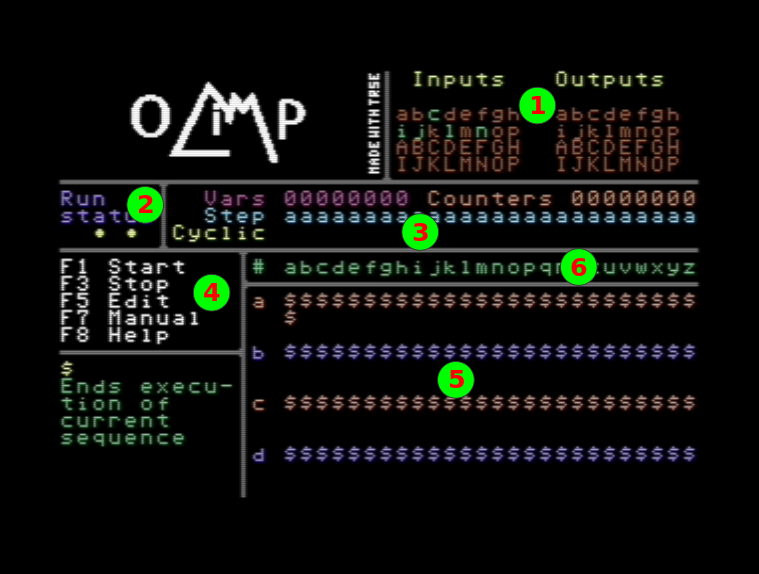

# Olimp - Zeus LT I/O Control #

This is a control program for [Zeus LT](http://www.retroshop.biz/product/zeus-lt/) module for Commodore 64. Original module was made back in 1990 by Željko Stevanović, and it was an open-source project published in Yugoslav computer magazine **Svet Kompjutera** (Computer World).
In short, it is an input/output interface that has up to 32 0-5V digital inputs and up to 32 220V digital outputs that are mapped inside 6502 I/O space at addresses $DE00-$DE03.

A friend of mine, Aleksandar Marić, remade this module as [Zeus LT](http://www.retroshop.biz/product/zeus-lt/).
He asked me to make a control program for the module, and I decided that it was the perfect time to learn how to use [Turbo Rascal Syntax Error](https://lemonspawn.com/turbo-rascal-syntax-error-expected-but-begin/) or **TRSE** for short.
TRSE didn't dissapoint, as it ofered the speed of assembly while allowing me to develop program logic in high-level language.

Here are the links to the original project from Svet Kompjutera (all text is in Serbian, but I am sure that the schematics are readable by anyone):

[Svet Kompjutera 10/1990](http://retrospec.sgn.net/users/tomcat/yu/magshow.php?page=23&all=SK_90_10)

[Svet Kompjutera 11/1990](http://retrospec.sgn.net/users/tomcat/yu/magshow.php?auto=&page=23&all=SK_90_11)

[Svet Kompjutera 12/1990](http://retrospec.sgn.net/users/tomcat/yu/magshow.php?auto=&page=29&all=SK_90_12)

[Svet Kompjutera 01/1991](http://retrospec.sgn.net/users/tomcat/yu/magshow.php?auto=&page=54&all=SK_91_01)

[Svet Kompjutera 02/1991](http://retrospec.sgn.net/users/tomcat/yu/magshow.php?auto=&page=64&all=SK_91_02)

[Svet Kompjutera 04/1991](http://retrospec.sgn.net/users/tomcat/yu/magshow.php?page=25&all=SK_91_04)

## Program description ##

The main idea of the program is that you can define sequences of commands that program can execute “in parallel”, meaning that if one sequence is for example waiting on some input to become 1 or 0, other sequences can run regardless.

Program supports up to 26 sequences (named a-z), each sequence can have up to 26 commands (with positions marked as a-z).

{width="565" height="427"}

1.  Current status of inputs and outputs
2.  Current status of the program (shows EDIT when in Edit mode, MANUAL
    when in Manual mode, and spinning char when executing sequences)
3.  Sequences, variables and counters state
    1.  Vars - value of variables (0 or 1)
    2.  Counters - value of counters (0-F hex, if greater than F, then
        up arrow is shown)
    3.  Step - current step of each sequence (shown when waiting on
        something)
    4.  Cyclic - shows if sequence is cyclic or not
4.  Main commands
    1.  F1 - Runs the sequences. You may alter outputs with a-p and A-P
        manually
    2.  F3 - Stops sequence execution/manual mode/edit mode
    3.  F5 - Edit sequences
    4.  F7 - Manual setting of outputs with a-p and A-P
    5.  F8 - Help
5.  Sequences
    1.  First column is sequence name a-z
    2.  Each sequence has 3 lines, first one shows commands, while other
        two are for command parameters
6.  Sequence/command positions for panes 3 and 5

Here is a video of program prototype testing (link made using [http://embedyoutube.org/](http://embedyoutube.org/)):

And another one from version 1.1:

## Execution of sequences ##

Each sequence can be set to be cyclic, which means that program will run it constantly.
Commands in non‑cyclic sequences can only be called or jumped to.
When executing sequences, Olimp runs through all of cyclic ones and executes their commands, and then repeats the process.
If some command requires the sequence to wait (for example, waiting for timer to expire, or waiting for some input to become 0 or 1), execution goes to the next cyclic sequence.
Execution of sequence finishes either after its last command is executed (step z) or if finish sequence command is encountered.

## Inputs, outputs, constants, variables, counters ##

Interface supports max 32 digital **inputs** and max 32 digital 1‑bit **outputs**.
In the program they are named using lower case letters **a-p** for inputs/outputs 1‑16 and upper case letters **A-P** for inputs/outputs 17‑32.

Supported **constants** include **0** and **1** that can be, for example, written directly to some output, and 2‑digit hexadecimal numbers that can be used to, for example, set the initial value of counter.

There are 8 1‑bit **variables**, marked with digits **2‑9**.
They are common for all sequences and can be used to communicate between them.

There is also 8 8‑bit counters named **s‑z**, also common for all sequences.
They can be set to some 8‑bit value and can be decreased until **0** is reached.

## Sequence editor ##

Sequence editor is entered by pressing **F5**.
After that, cursor appears, and can be moved using cursor keys.
Placing cursor over command line in a sequence allows you to enter a new command in that position.

If command has parameters, a question mark is placed in their place and border turns red.
That is the indication that you have unfinished commands in a sequence and sequences cannot be run until parameters are filled (using the same logic as with entering the commands).

You can use **CLR/HOME** key to erase a command in a sequence and **INS/DEL** to insert a new one in a arbitrary place as long as there is a room to do that (if last command in a sequence is **$**).
These commands will adjust jump targets that are inside the current sequence.

Key **RUN/STOP** sets/resets the cyclic status of a sequence.

If all commands are defined, you can press **F1** to directly execute them.

## Runing sequences ##

When sequences start to run, you still have the possibility to change the outputs manually by pressing **a‑p** or **A‑P**.
This is indicated by arrows at Outputs display.

Pressing **F1** while running sequences stops reading of the inputs and allows you to set the inputs manually.
This is indicated by arrows at Inputs display and can be used to test the sequence execution without waiting for real inputs.
Pressing the **F1** again returns to normal state of execution.

## Disk operations ##

On this screen you can save or load a sequence, or you can display current directory.
After pressing **F1** or **F3**, you can enter the file name, up to 12 characters (letters, numbers and space).
You can use **DEL** to delete last character, and **RUN/STOP** to cancel loading or saving.

Drive number can be selected with **+**/**-** keys.

All Olimp files are saved with **.OLI** extension and only those files are displayed when listing a directory.

## Commands ##

Each command consist of only one character, and can have 1 or 2 additional characters as parameters.
In the editor, they are written one below another in each sequence.

### Set output or variable ###

This is a 2-character command where first character represents source and can be input, 0, 1 or a variable, and second character is destination and can be output or variable.

**1a** - write **1** to output **a**

**bC** - write value of input **b** to output **C**

**03** - write **0** to variable **3**

### Set counter to hexadecimal value ###

This is a 3-character command where first character represents counter to be set **s-z**, and second and third one are hexadecimal
digits.

**s0F** - set counter s to value **$0F** (15)

**z80** - set counter z to value **$80** (128)

### Wait for input to become 1 ###

This is a 2-character command where first character is **\*** and second is input to check, **a‑p** or **A‑P**.

**\*a** - sequence is stopped until input **a** becomes **1**

**\*P** - sequence is stopped until input **P** becomes **1**

### Wait for input to become 0 ###

This is a 2-character command where first character is **/** and second is input to check, **a‑p** or **A‑P**.

**/a** - sequence is stopped until input **a** becomes **1**

**/P** - sequence is stopped until input **P** becomes **1**

### Wait specified number of 1/10 seconds ###

This is a 3-character command where first character is **@** and second and third one are hexadecimal digits.

**@0A** - sequence is stopped for **10** 1/10 seconds (1 second)

**@32** - sequence is stopped for **50** 1/10 seconds (5 seconds)

### Jump to another step ###

This is a 3-character command where first character is **\#**, second is step to jump to **a‑z**, and third is sequence to jump to **a‑z**. When entering this command, third parameter is automatically filled with current sequence.

**#nb** - jump to sequence **b**, step **n**

**#za** - jump to sequence **a**, step **z**

Be aware that this can skip execution of some sequences, for example if you jump from sequence **a** to sequence **d** and then finish execution, next sequence to be executed will be **e**, and sequences **b** and **c** would not run even if they are set to be cyclic.

### Copy counter to another one ###

This is a 3-character command where first character is **!**, second is copy-from counter **s‑z** and third is is copy-to counter **s‑z**.

**!sz** - copy value of counter **s** to counter **z**

### Call sub-sequence ###

This is a 3-character command where first character is **+**, second is step to jump to **a‑z** and third is sequence to jump to **a‑z**.

**+nb** - calls sequence **b**, step **n**

**+za** - calls sequence **a**, step **z**

Be aware that there is a 16‑position stack that holds return positions (command right after the call) for these calls and that program could crash if there is a mismatch between number of calls and returns from call.

### Return from call ###

This is a 1-character command **-**.

**-** - returns to a step right after last call

### Finish sequence ###

This is a 1-character command **$**.

**$** - finishes execution of the current sequence

### Check if input or variable is 1 ###

This is a 3-character command where first character is **?**, second is input to check, **a‑p** or **A‑P** or variable **2-9**, and the third one is step to jump to if condition is true.

**?af** - if input input **a** is **1**, jump to step **f**, otherwise go to next step

**?9m** - if variable **9** is **1**, jump to step **m**, otherwise go to next step

### Check if input or variable is 0 ##

This is a 3-character command where first character is **%**, second is input to check, **a‑p** or **A‑P** or variable **2-9**, and the third one is step to jump to if condition is true.

**%af** - if input input **a** is **0**, jump to step **f**, otherwise go to next step

**%9m** - if variable **9** is **0**, jump to step **m**, otherwise go to next step

### Copy inputs to vars ###

This is a 2-character command where first character is **<** and second represents group of 8 inputs **1‑4**.

**<1** - copy values of inputs **a-h** to variables **2-9**

**<4** - copy values of inputs **I-P** to variables **2-9**

### Copy vars to inputs ###

This is a 2-character command where first character is **>** and second represents group of 8 inputs **1‑4**.

**>1** - copy values of variables **2-9** to inputs **a-h**

**>4** - copy values of variables **2-9** to inputs **I-P**

### Bitwise AND ###

This is a 3-character command where first character is **&**, and second and third ones are input **a‑p** or **A‑P**, variable **2-9** or constant **0-1**.

**&a2** - perform bitwise AND between input **a** and variable **2** and puts result in variable **9**

**&aD** - perform bitwise AND between input **a** and input **D** and puts result in variable **9**

### Bitwise OR ###

This is a 3-character command where first character is **=**, and second and third ones are input **a‑p** or **A‑P**, variable **2-9** or constant **0-1**.

**=a2** - perform bitwise OR between input **a** and variable **2** and puts result in variable **9**

**=aD** - perform bitwise OR between input **a** and input **D** and puts result in variable **9**

### Bitwise XOR ###

This is a 3-character command where first character is **↑**, and second and third ones are input **a‑p** or **A‑P**, variable **2-9** or constant **0-1**.

**↑a2** - perform bitwise XOR between input **a** and variable **2** and puts result in variable **9**

**↑b1** - perform bitwise XOR between input **b** and constant **1** and puts result in variable **9** (this efectively inverts value of input **b**)

### Set all vars to hexadecimal value ###

This is a 3-character command where first character is **←**, and second and third one are hexadecimal digits.

**←AF** - Set variables **2‑9** to binary value **10101111**

### Set cyclic status for a sqeuence ###

This is a 3-character command where first character is **£**, second is sequence **a‑z** and third one is cyclic status **0-1** or variable **2-9**.

**£a1** - set cyclic status of sequence **a** to **1**

**£b2** - set cyclic status of sequence **b** to value of variable **2**

### Decrease counter and check if it is equal to 0 ###

This is a 3-character command where first character is **:**, second is counter **s‑z** and the third one is a step to jump to if counter value is **0**. If the counter value is greater than **0**, it is decreased and execution goes to next step.
If counter value is **0**, execution jumps to step from last parameter (similar to checks if input or variable is 0 or 1).

**:sk** - if counter **s** is greater than **0** decrease it and go to next step, otherwise jump to step **k**

### Copy counter value to variables ###

This is a 2-character command where first character is **\[**, and second is counter **s‑z**.

**\[s** - copy 8-bit counter **s** to variables **2-9**

### Copy variables to counter ###

This is a 2-character command where first character is **\]**, and second is counter ***s‑z**.

**\]s** - copy variables **2-9** to 8-bit counter **s**

## Sequence examples ##

All examples assume that sequence is set to be cyclic.
This also means that the sequence is repeated once it is finished.

### Copy inputs to outputs ###

**ab ba $**

Copy input **a** to output **b**

Copy input **b** to output **a**

### Blink output with 2s period ###

**1a @0A 0a @0A $**

Put **1** to output **a**

Wait 1 second

Put **0** to output **a**

Wait 1 second

### Blink output with 0.4s period only if input is set to 1 ###

**\*a 1a @02 0a @02 $**

Wait for input **a** to become **1**

Put **1** to output **a**

Wait 1 second

Put **0** to output **a**

Wait 1 second

### Wait for 5 impulses on input ###

**s05 \*a /a :sf \#b 1b**

Put **5** to counter **s**

Wait for input **a** to become **1**

Wait for input **a** to become **0**

If counter **s** is greater than **0**, decrease it and go next step (**e**) which jumps back to position **b**

If counter **s** is equal to **0**, jump to step **f**, that puts **1** to output **b**

### Debounce input ###

**\*a @02 %aa 1b**

Wait for input **a** to become 1

Wait 0.2 seconds

If input **a** became **0**, go back to step **a**, otherwise set output **b** to **1**

## Files in this repository ##

* Olimp.ras - Turbo Rascal source code

* Olimp.trse - Turbo Rascal project file

* Olimp.prg - Compiled code

* Olimp_v1.4.d64 - Olimp program and one sequence example

* cursor.flf - Cursor sprite

* font.flf - Charset

* main_screen.prg - Main screen in binary format (Krissz's PETSCII Editor)

* disk_screen.prg - Disk screen in binary format (Krissz's PETSCII Editor)

* help_N.prg - Help screens in binary format (Krissz's PETSCII Editor)

* gpl.txt - Licence information

* Docs

    * Manual.pdf, Manual.odt - User manual
    
    * Manual.svg - Olimp main screen with numbers

* Media

    * logo.png - Program logo by Tamara Milutinović

    * pica.64c - Original font used for characters

* Tools

    * 64c2bin.py - Converts 64c font files to 2 bin files, for first and second 128 chars

    * krissz2bin.py - Extracts screen from prg file made in [http://petscii.krissz.hu](http://petscii.krissz.hu) and converts it to bin file

    * krissz2flf.py - Extracts screen from prg file made in [http://petscii.krissz.hu](http://petscii.krissz.hu) and converts it to TRSE FLF file

    * png2logo.py - Converts 8-bit gray PNG to C64 font

## Compiling ##

To compile this code on your own, you'll need TRSE version 0.13.

## Licence ##

All code is licenced under GPL 3 or later. See gpl.txt for details.

## TODO ##

* Make operations with I/O faster by setting the bits directly and printing the status of inputs/outpust as needed

* Improve the code based on new TRSE developments

* Squash all the bugs!

## History ##

1.4 - 21.06.2021.

* Added in-program help

* Added screen for disk operations

* Implemented saving and loading of sequences, added code for directory listing

* Removed PWM code due to hardware not being sufficiently fast

* Changed syntax of call command to match jump command

* Added command to copy counter to another one, "!"

* Implemented "[" and "]" commands

* Fixed inset/delete in editor

* Cyclic status set in editor is now preserved after sequences running

1.3 - internal

* Functionality of command for jumping into current sequence "#" was replaced with code to jump to any sequence (former "!" command).
Current cequence is automatically filled as second parameter (as this would be the most common situation).

* New command for setting the PWM on triac outputs is intoduced (it took the name of former command to jump to other sequence, "!")

* CIA timer for interrupt is sped up to support PWM better.
This also prompted the change in the interrupt routine to slow down key repeat of KERNAL's SCNKEY routine.

* Fixed entering numbers 0-9

1.2 - internal

* Editing moves forward automatically for newely entered commands

* Moving cursor left/right moved to separate functions

1.1 - 17.04.2021.

* Fix for suspicious address decoding on the cartridge

* Added version information into the program

* Changed when to update screen border color, thus removing grey dots when in editing mode

1.0 - 16.04.2021.

* Initial version

