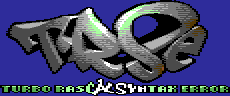

# TRSE

## What is Turbo Rascal Syntax error, “;” expected but “BEGIN”?

In a nutshell, Turbo Rascal Syntax error, “;” expected but “BEGIN” is a complete suite for developing games and demos for older computer systems. TRSE is created with Qt (C++), and runs as a stand-alone application that contains various tools for developing and deploying projects for these processors. 

Read more at [Turbo Racal SE Hompage](http://www.turborascal.com).

## Repository
Turbo Rascal Syntax Error full repo 
- C++
- Qt

## Prepare
First, clone this repo to a TRSE directory.

### Linux
(note that these should be upgraded to qt6. need to find a clean linux computer to test on, probably just qt6 and qt6-base)
- apt-get install qt5base5-dev qt5-qmake qtdeclarative5-dev mesa-common-dev

On windows/macos, you need to download and install the qt libraries, msvc, xcode etc:

### Windows
- install MSVC 2019
- download the Qt framework from https://www.qt.io/download. Install the latest framework of Qt6 (desktop application).

### Macos
- install Xcode 
- download the Qt framework from https://www.qt.io/download. Install the latest framework of Qt6 (desktop application).

### ARM chromebook/ARM computers
- sudo apt install qtbase5-dev qt5-qmake qtbase5-dev-tools qtdeclarative5-dev

## Compiling
- qmake TRSE.pro
- make -j8

## Lua issues
TRSE needs Lua 5.3.5 (for .fjo ray tracer support), and has static libraries compiled up for x64/apple arm/freebsd/linux. If you have some other OS, do the following: - 

- download lua 5.3.5 from https://www.lua.org/ftp/lua-5.3.5.tar.gz
- compile it (just "make")
- copy the liblua.a file to TRSE/libs/lua/liblua_myos.a
- add the library to the project path in TRSE.pro, ie "LIBS += -L$$PWD/libs/lua/ -llua_myos"

## Windows XP build (optional, 32-bit)
The normal build is unchanged. To build for Windows XP, use the last Qt that supports it (Qt 5.6.3) with its bundled MinGW 4.9.2 (32-bit). Both come from the Qt 5.6.3 offline installer (qt-opensource-windows-x86-mingw492-5.6.3.exe), not from the current Qt installer.

- put the Qt bin folder (...\5.6.3\mingw49_32\bin) and the MinGW bin folder (...\Tools\mingw492_32\bin) on the PATH
- mkdir build && cd build
- qmake ..\TRSE.pro -spec win32-g++ CONFIG+=release CONFIG+=winxp
- mingw32-make -j8

CONFIG+=winxp is the only switch. It sets the Windows XP API level, builds as C++14, adds the Qt 5.6 compatibility headers from source/compat_qt56, defines TRSE_QT56, and links libs/lua/liblua_xp.a (Lua 5.3.5 built for 32-bit MinGW 4.9.2, see "Lua issues"). Without it nothing changes for any other build.

To run the result, copy trse.exe next to the deployed Qt DLLs (windeployqt) plus libgomp-1.dll from the MinGW bin folder, and put the units folder next to it.

## OpenMP issues
The fjong ray tracer uses OpenMP if available. If you are having issues with compiling up / getting openMP to work, add "DEFINES -= USE_OMP" to the TRSE.pro file.

Select "Release", and under the qt project/build make sure you set the build directory to be **TRSE/Release**

## After first compile:
TRSE uses a couple of directories that needs to be linked with symlinks:
- Copy the directory "themes" in **TRSE/Publish/source/** to the **TRSE/Release** build directory 
- Make a symbolic link called "tutorials from your build directory to point to Publish/tutorials to access tutorial projects from the front page 
- Make a symbolic link called "units from your build directory to point to TRSE/Units to access the TRSE library 
- Make a symbolic link "project_templates" from your build directory to point to Publish/project_templates in order to access the "New Project" templates

# Source code information
A compiler UML diagram can be found here: https://github.com/leuat/TRSE/blob/master/uml/compiler.png

